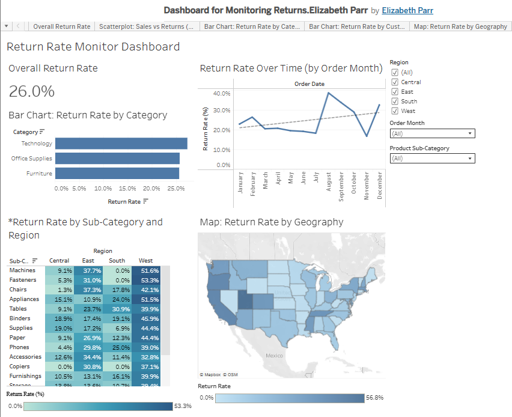

# 📊 Return Rate Monitoring Dashboard (Tableau)

## 🔍 Project Overview
This project analyzes customer return behavior to identify patterns and potential root causes. Using Tableau, the analysis explores return rates across time, geography, product categories, and customers to understand where returns are concentrated.

The result is an interactive dashboard designed to support ongoing monitoring and root-cause investigation.

## 🔗 Tableau Dashboard
- [View Interactive Dashboard](https://public.tableau.com/views/DashboardforMonitoringReturns_ElizabethParr/ReturnRateMonitorDashboard?:language=en-US&publish=yes&:sid=&:redirect=auth&:display_count=n&:origin=viz_share_link)

## 📈 Key Insights
- Return rates vary over time, indicating seasonal patterns  
- Return behavior differs across product categories and sub-categories  
- Certain sub-categories show elevated return rates in specific regions  
- Geographic analysis highlights states with consistently higher return rates  
- A subset of repeat customers exhibits consistently high return behavior  

## 📊 Dashboard Features
- KPI view of overall return rate  
- Time-series analysis of return trends  
- Category and sub-category comparison views  
- Geographic return distribution analysis  
- Interactive filters for deeper exploration  

## 🛠️ Tools Used
- Tableau Desktop  
- Tableau Public  

## 💡 Project Improvement
- Updated the *Return Rate by Sub-Category and Region* visualization from a stacked bar chart to a highlight table to improve clarity and interpretability of percentage-based data  

## 👤 Author
Elizabeth Parr
